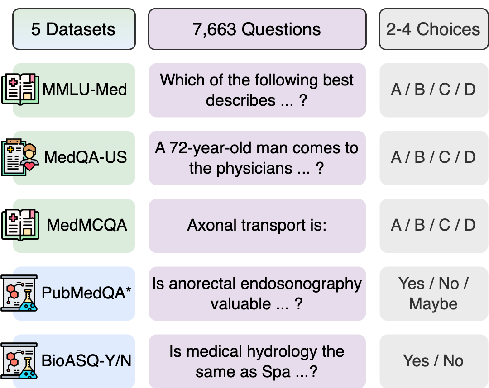
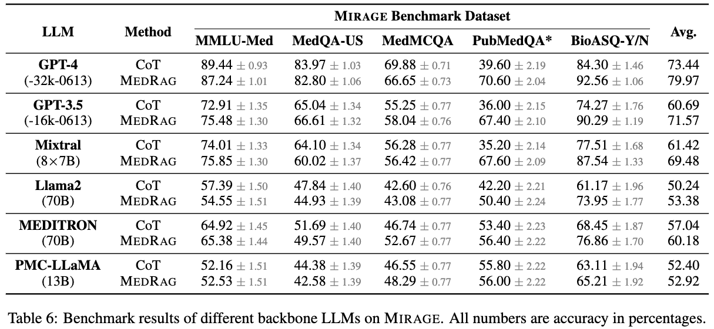
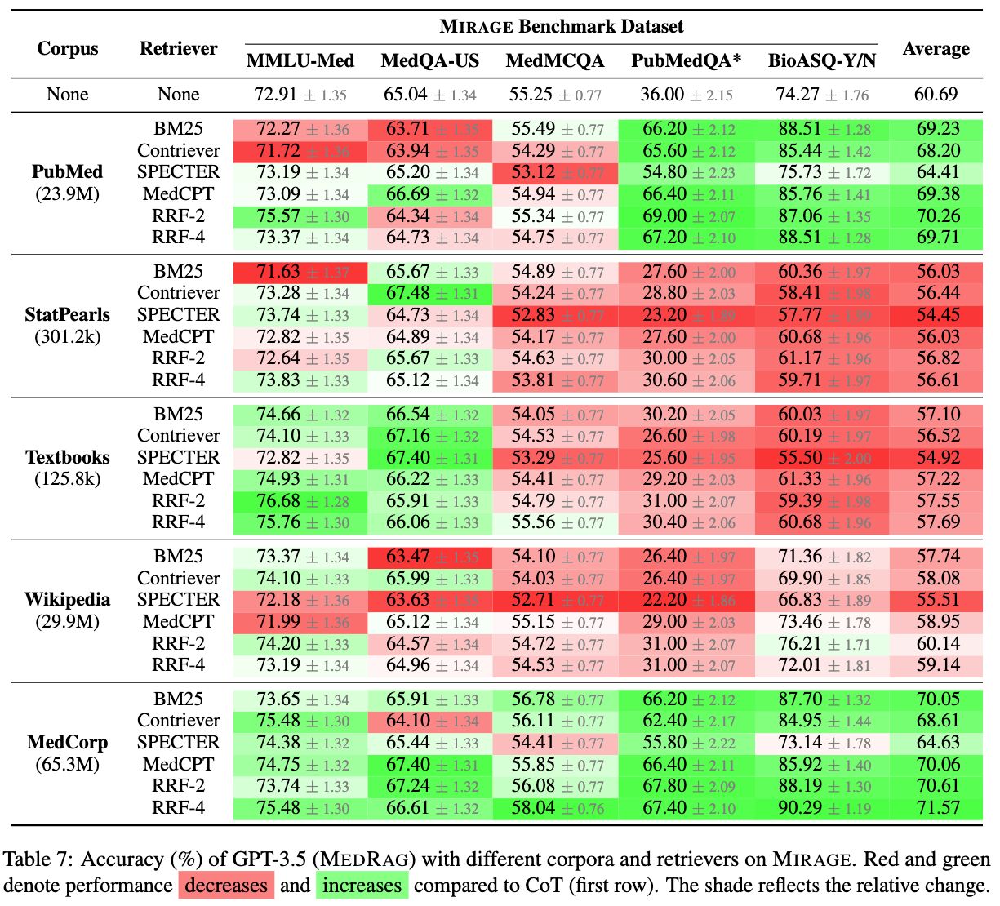

# MIRAGE Benchmark

Welcome to the GitHub page of `MIRAGE` (Medical Information Retrieval-Augmented Generation Evaluation) Benchmark! This repository contains a comprehensive dataset and benchmark results aimed at evaluating Retrieval-Augmented Generation (RAG) systems for medical question answering (QA). We use the [`MedRAG`](https://github.com/Teddy-XiongGZ/MedRAG) toolkit to evaluate existing solutions of various components in RAG on MIRAGE.

The benchmark data is stored as `benchmark.json` in this repo, which can also be downloaded from [Google Drive](https://drive.google.com/file/d/1ryvimxhOJXVGpYEIY_eak9X_YVWz1Axd/view?usp=sharing).

[](https://arxiv.org/abs/2402.13178)
[](https://teddy-xionggz.github.io/benchmark-medical-rag/)
[](https://teddy-xionggz.github.io/MIRAGE/)

## Table of Contents

- [Introduction](#introduction)
- [Dataset](#dataset)
- [Benchmark Results](#benchmark-results)
- [Usage](#usage)
- [Citation](#citation)

## Introduction

For a realistic evaluation purpose, MIRAGE adopts four key evaluation settings:

**Zero-Shot Learning (ZSL)**: Input QA systems are evaluated in a zero-shot setting where in-context few-shot learning is not permitted.

**Multi-Choice Evaluation (MCE)**: Multi-choice Questions are used to evaluate given systems. 

**Retrieval-Augmented Generation (RAG)**: Input systems should perform retrieval-augmented generation, which need to collect external information for accurate and reliable answer generation.

**Question-Only Retrieval (QOR)**: To align with real-world cases of medical QA, answer options should not be provided as input during the retrieval.

## Dataset

The following figure presents the overview of MIRAGE, which shows that MIRAGE contains five commonly used datasets for medical QA for the evaluation of RAG systems, including three medical examination QA datasets and two biomedical research QA datasets:

- [MMLU](https://github.com/hendrycks/test)-Med: A medical examination QA dataset with 1089 questions. A subset of six tasks that are related to biomedicine are selected from MMLU, including anatomy, clinical knowledge, professional medicine, human genetics, college medicine, and 996
college biology. 
- [MedQA](https://github.com/jind11/MedQA)-US: A medical examination QA dataset. We focus on the real-world English subset in MedQA with questions from the US Medical Licensing Examination (MedQA-US), including 1273 four-option test samples.
- [MedMCQA](https://medmcqa.github.io/): A medical examination QA dataset. We chose the dev set of the original MedMCQA, which includes 4183 medical questions from Indian medical entrance exams.
- [PubMedQA](https://pubmedqa.github.io/)\*: A biomedical research QA dataset. We build PubMedQA\* by removing given contexts in the 500 expert-annotated test samples of PubMedQA. The possible answer to a PubMedQA* question can be yes/no/maybe, reflecting the authenticity of the question statement based on scientific literature.
- [BioASQ](http://bioasq.org/)-Y/N: A biomedical research QA dataset. We select the Yes/No questions in the ground truth test set of BioASQ Task B from the most recent five years (2019-2023), including 618 questions in total. The ground truth snippets are removed in this benchmark.

<!--  -->


Statistics of datasets in MIRAGE are shown below:

| Dataset     | Size | #O. | Avg. L | Source      |
|-------------|------|-----|--------|-------------|
| MMLU-Med    | 1,089| 4   | 63     | Examination |
| MedQA-US    | 1,273| 4   | 177    | Examination |
| MedMCQA     | 4,183| 4   | 26     | Examination |
| PubMedQA*   | 500  | 3   | 24     | Literature  |
| BioASQ-Y/N  | 618  | 2   | 17     | Literature  |

(\#O.: numbers of options; Avg. L: average token counts in each question.)

## Benchmark Results

The following table shows the benchmark results of different backbone LLMs.


<!--  -->

This table shows the comparison of different corpora and retrievers on MIRAGE.


<!--  -->

## Usage

Load the benchmark:
```python
>>> import json
>>> benchmark = json.load(open("benchmark.json"))
```

Load specific datasets in the benchmark (e.g., mmlu):
```python
>>> from src.utils import QADataset

>>> dataset_name = "mmlu"
>>> dataset = QADataset(dataset_name)

>>> print(len(dataset))
1089

>>> print(dataset[0])
{'question': 'A lesion causing compression of the facial nerve at the stylomastoid foramen will cause ipsilateral', 'options': {'A': 'paralysis of the facial muscles.', 'B': 'paralysis of the facial muscles and loss of taste.', 'C': 'paralysis of the facial muscles, loss of taste and lacrimation.', 'D': 'paralysis of the facial muscles, loss of taste, lacrimation and decreased salivation.'}, 'answer': 'A'}
```

Evaluate prediction results saved in `./prediction` for both CoT generation and RAG with 32 snippets:
```cmd
# CoT with GPT-3.5
python src/evaluate.py --results_dir ./prediction --llm_name OpenAI/gpt-35-turbo-16k

# MedRAG-32 with GPT-3.5
python src/evaluate.py --results_dir ./prediction --llm_name OpenAI/gpt-35-turbo-16k --rag --k 32

# CoT with GPT-4
python src/evaluate.py --results_dir ./prediction --llm_name OpenAI/gpt-4-32k

# MedRAG-32 with GPT-4
python src/evaluate.py --results_dir ./prediction --llm_name OpenAI/gpt-4-32k --rag --k 32
```

## Citation
```
@article{xiong2024benchmarking,
    title={Benchmarking Retrieval-Augmented Generation for Medicine}, 
    author={Guangzhi Xiong and Qiao Jin and Zhiyong Lu and Aidong Zhang},
    journal={arXiv preprint arXiv:2402.13178},
    year={2024}
}
```
